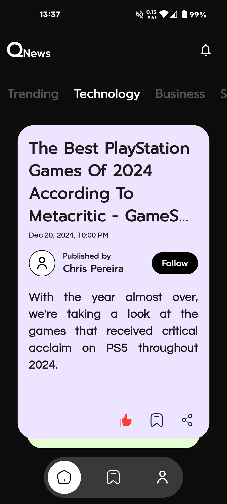

# Qnews (Quick News)

QNews is a sleek and intuitive news app that fetches the latest headlines from the powerful NewsAPI. Designed to keep you informed and inspired, QNews provides a seamless news experience with features like bookmarking articles, liking articles, and easy sharing with just a tap.

For readers who want to dive deeper into stories, QNews includes a "Read Full Article" button that takes you directly to the source's web page, ensuring you never miss any details. Whether you're catching up on global events or exploring niche topics, QNews makes staying updated effortless and enjoyable.

Its clean and user friendly UI is designed for readers who value speeed and simplicity!

Stay informed, stay inspired — with QNews!

# Output

    
    
    
    

